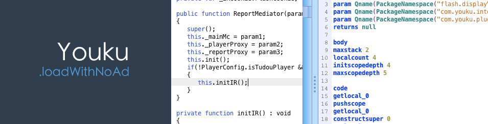

### About
As you know......

### Download

```
git clone https://github.com/qddegtya/Youku.loadWithNoad.git
```

### Start Server 

```
cd Youku.loadWithNoad && python -m SimpleHTTPServer 8011
```

### Install chrome extension

Open Url:

```
chrome://extensions/
```

Drag Youku.loadWithNoad.crx to your chrome

Then Enjoy!
